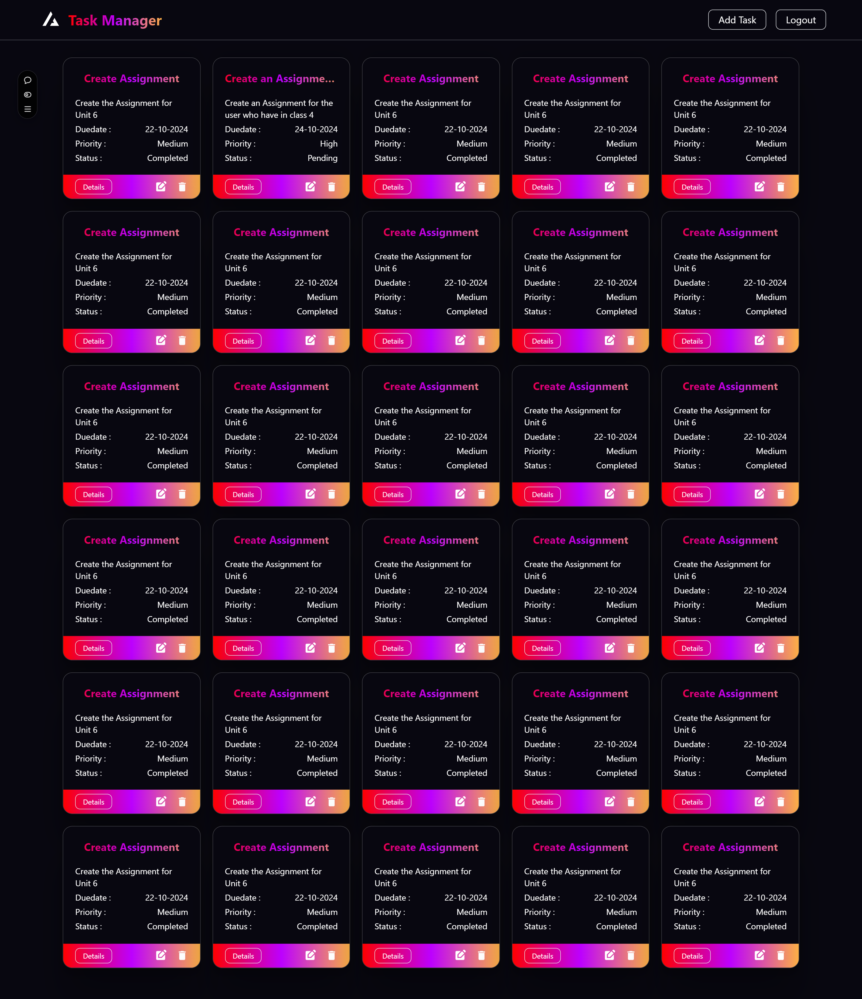
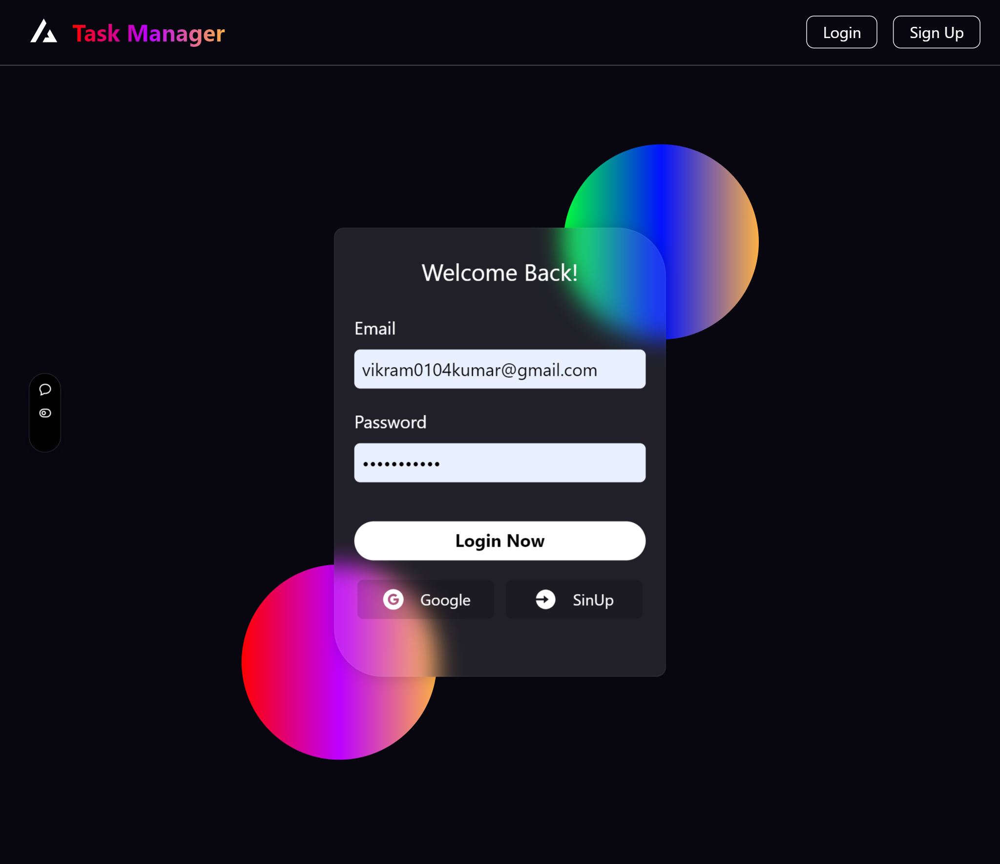
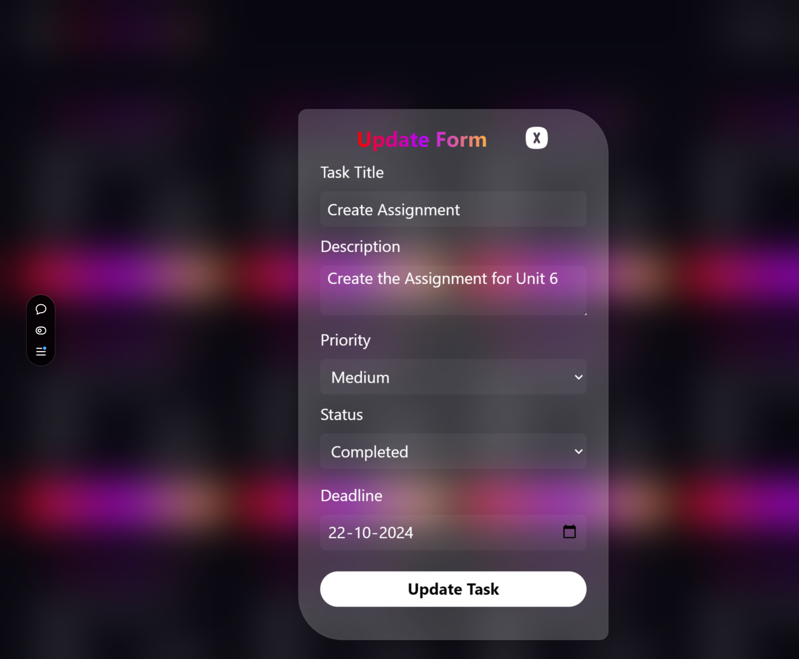
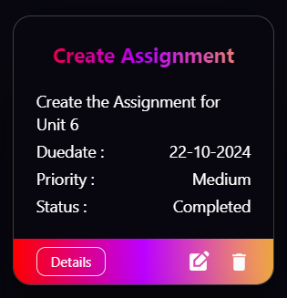

# Task Management Application.

Welcome to the Task Management Application! This application allows users to manage tasks efficiently with a sleek UI and seamless user experience. Users can create, edit, update, delete tasks, and even drag task cards for interactivity, thanks to the Framer Motion library. Additionally, users can view detailed information about each task on a separate details page. User authentication ensures that only logged-in users can access the application features.

## Run Locally

Clone the project

```bash
  git clone https://github.com/vikram0104irctc/Task_Management
```

Go to the project Client directory

```bash
  cd Task_Management/client
```

Install dependencies

```bash
  npm install
```

Start the server

```bash
  npm run dev
```

Go to the project server directory

```bash
  cd Task_Management/server
```

Install dependencies

```bash
  npm install
```

Start the server

```bash
  npm run start
```

## 🔗 Developers

- Vikram Kumar Choudhary: (https://github.com/vikram0104irctc)

## Tech Stack

**Frontend:** HTML, CSS, JSX, React.js
_libraries:_ Redux, axios, React-router-dom, react-icons, Framer Motion, React Toastify <br/>
**Backend:** Node.js, Mongodb, Express.js
_libraries:_ Argon2, CORS, JSON Web Token<br/>

# Project Type

- Full Stack (Frontend and Backend)

# Deployed Link

- https://taskmanagerwebapp.vercel.app/

# Features

- **User Authentication**: Secure signup and login with JWT tokens. Only authenticated users can interact with the application.
- **Private Routes**: Access to the task management dashboard is restricted to logged-in users.
- **Task Management**: Create new tasks, Edit existing tasks, Update task status or content, Delete tasks.
- **Task Dragging**: Task cards can be dragged and reorganized using Framer Motion for enhanced user interactivity.
- **Task Details Page**: Users can click on a task to view detailed information about it.

# Landing Page

- A brief overview of the app with an intuitive task management interface, powered by React and Redux.



# Authentication

- **SignUp and SignIn**: Secure user registration and login with password hashing (argon2) and JSON Web Tokens (JWT).



## Task Management

# Task Creation

- **Task Creation**: Add new tasks to your to-do list.


- **Task Edit & Update**: Modify the details of your existing tasks.



-- **Task Deletion**: Remove completed or irrelevant tasks with ease.



# Task Dragging (Framer Motion)

- **Drag & Drop**: Interact with task cards by dragging and dropping them into new positions.

# Task Details Page

- **View Full Task Details**: Click on any task to view more information such as description, due date, and priority.

# FAQ

- **Is the website optimized for mobile devices?**
- Yes, the application is fully responsive and provides a seamless experience across devices.

- **How is user authentication handled?**
- Authentication is managed using JSON Web Tokens (JWT), ensuring secure access to private routes. Passwords are securely hashed using argon2.

# Project Directory Structure

```plaintext
TASK-MANAGEMENT/
├── client/
│   ├── node_modules/
│   ├── public/
│   ├── src/
│   │   ├── assets/
│   │   │   ├── landingpage.png
│   │   │   ├── loginpage.png
│   │   │   ├── modification.png
│   │   │   ├── react.png
│   │   │   ├── taskadd.png
│   │   │   ├── taskupdate.png
│   │   ├── components/
│   │   │   ├── detailspage.jsx
│   │   │   ├── home.jsx
│   │   │   ├── login.jsx
│   │   │   ├── navbar.jsx
│   │   │   ├── signup.jsx
│   │   │   ├── task.jsx
│   │   │   ├── updateTask.jsx
│   │   ├── private/
│   │   │   └── privateroute.jsx
│   │   ├── redux/
│   │   │   ├── actions.jsx
│   │   │   ├── reducer.jsx
│   │   │   └── store.jsx
│   ├── App.jsx
│   ├── index.css
│   ├── main.jsx
│   ├── postcss.config.js
│   ├── tailwind.config.js
│   └── vite.config.js
├── server/
│   ├── config/
│   │   └── db.js
│   ├── controller/
│   │   ├── alltask.controller.js
│   │   ├── deletetask.controller.js
│   │   ├── edittask.controller.js
│   │   ├── login.controller.js
│   │   ├── newtask.controller.js
│   │   └── register.controller.js
│   ├── middleware/
│   │   └── authMiddleware.js
│   ├── model/
│   │   ├── task.model.js
│   │   └── user.model.js
│   ├── routes/
│   │   ├── logintask.route.js
│   │   └── task.route.js
│   ├── .env
│   ├── index.js
│   └── package.json
├── .gitignore
├── README.md
├── package-lock.json
├── package.json
├── postcss.config.js
├── tailwind.config.js
├── vercel.json
└── vite.config.js
```
